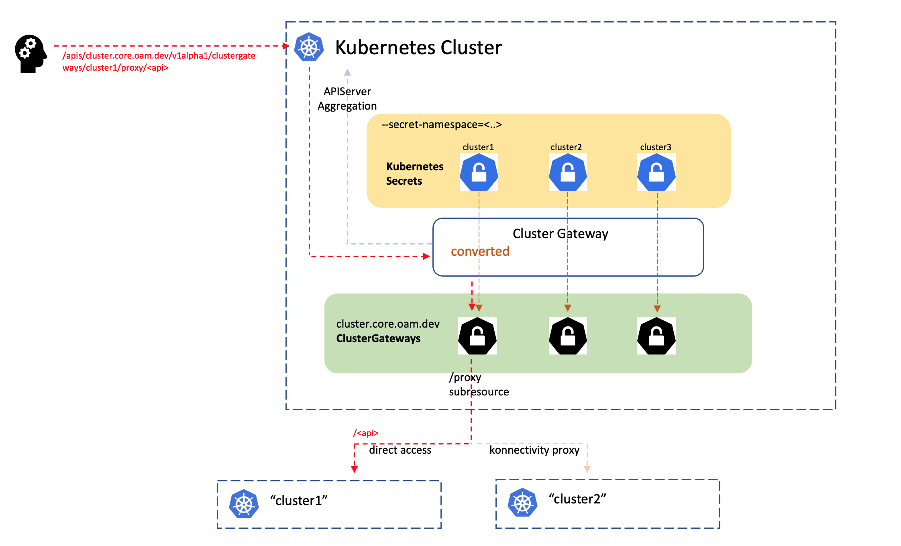

# Cluster Gateway

## Overall

"Cluster Gateway" is a gateway apiserver for routing kubernetes api traffic
to multiple kubernetes clusters. Additionally, the gateway is completely 
pluggable for a running kubernetes cluster natively because it is developed
based on the native api extensibility named [apiserver-aggregation](https://kubernetes.io/docs/concepts/extend-kubernetes/api-extension/apiserver-aggregation/).
A new extended resource "cluster.core.oam.dev/ClusterGateway" will be 
registered into the hosting cluster after properly applying corresponding 
`APIService` objects, and a new subresource named "proxy" will be available 
for every existing "Cluster Gateway" resource which is inspired by the 
original kubernetes "service/proxy", "pod/proxy" subresource.

Overall our "Cluster Gateway" also has the following merits as a multi-cluster 
api-gateway solution:

- __Etcd Free__: Normally an aggregated apiserver must be deployed along 
  with a dedicated etcd cluster which is bringing extra costs for the admins. 
  While our "Cluster Gateway" can be running completely without etcd instances,
  because the extended "ClusterGateway" resource are virtual read-only 
  kubernetes resource which is converted from secret resources from a namespace
  in the hosting cluster.
  
- __Scalability__: Our "Cluster Gateway" can scale out to arbitrary instances
  to deal with the increasing loads 
  



## Image

```shell
$ docker pull oamdev/cluster-gateway:v1.1.6 # Or other newer tags
```

## Documentation

- __Run Local__: https://github.com/oam-dev/cluster-gateway/blob/master/docs/non-etcd-apiserver/local-run.md

#### Resource Example

```yaml
apiVersion: "cluster.core.oam.dev/v1alpha1"
kind: "ClusterGateway"
metadata:
  name: <..>
spec:
  provider: ""
  access:
    endpoint: "https://127.0.0.1:9443"
    caBundle: "..."
    credential:
      type: X509Certificate
      x509:
        certificate: "..."
        privateKey: "..."
status: { }      
```

### Performance

Compile the e2e benchmark suite by:

```shell
$ make e2e-benchmark-binary
```


The benchmark suite will be creating-updating-deleting configmaps in a flow
repeatly for 100 times. Here's a comparison of the performance we observed
in a local experiment:


|  Bandwidth  |  Direct          |  ClusterGateway  | ClusterGateway(over Konnectivity) |
|-------------|------------------|------------------|-----------------------------------|
|  Fastest    |  0.083s          |  0.560s          | 0.556s                            |
|  Slowest    |  1.078s          |  1.887s          | 2.579s                            |
|  Average    |  0.580s ± 0.175s |  0.849s ± 0.361s | 1.408s ± 0.542s                   |